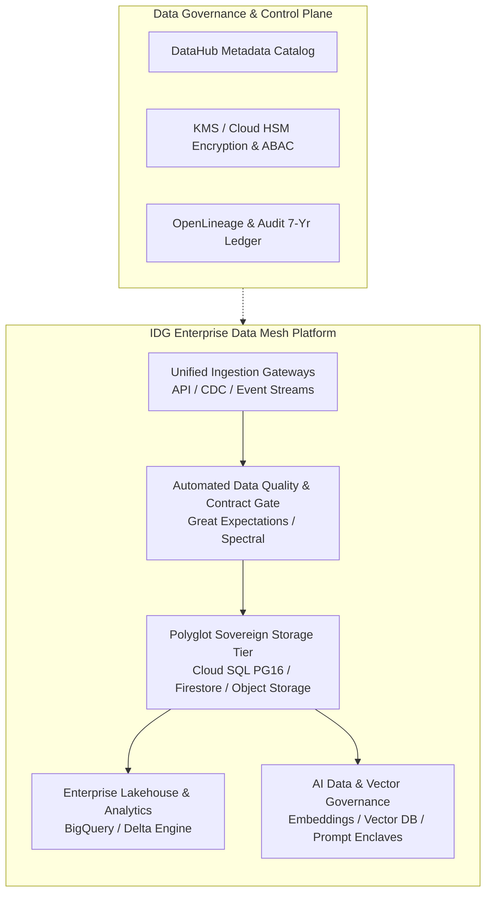
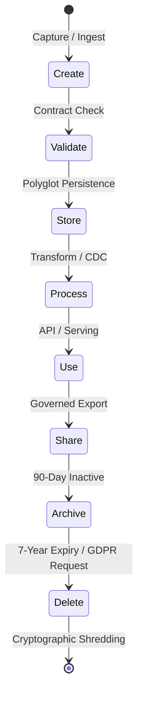
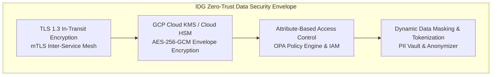
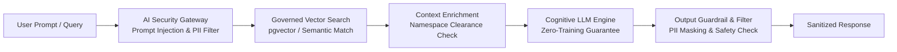
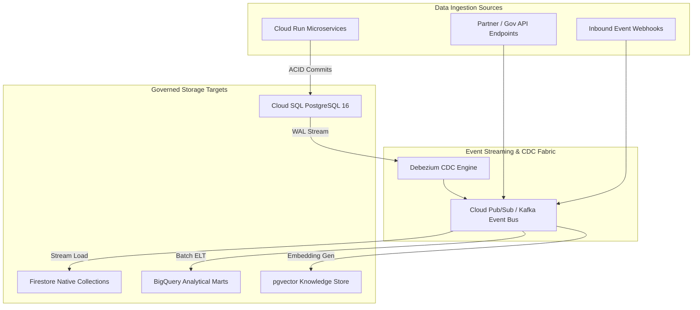
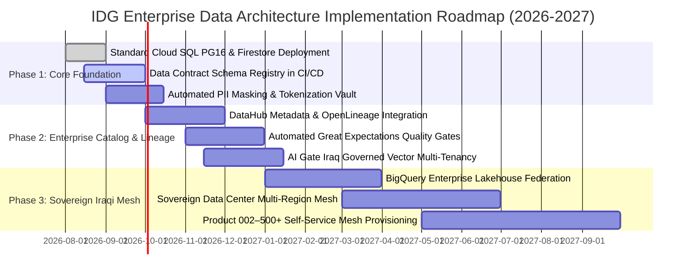

# IDG Enterprise Data Architecture Specification
## Document Identifier: IDG-SPEC-DATA-2026-V1

```
================================================================================
IRAQ DIGITAL GATEWAY (IDG) — ENTERPRISE ARCHITECTURE FRAMEWORK
DOCUMENT ID:    IDG-SPEC-DATA-2026-V1
CLASSIFICATION: ENTERPRISE ARCHITECTURE STANDARD
STATUS:         PRODUCTION APPROVED
APPLICABILITY:  IDG HOLDING, PRODUCT 001 (AI GATE IRAQ), PRODUCT 002–500+
================================================================================
```

---

## 01. Document Control & Metadata

| Attribute | Enterprise Specification Value |
| :--- | :--- |
| **Document ID** | `IDG-SPEC-DATA-2026-V1` |
| **Document Title** | Enterprise Data Architecture Specification |
| **Standard Level** | Tier 1 Core Technical Specification |
| **Parent Entity** | Iraq Digital Gateway (IDG) |
| **Flagship Product** | AI Gate Iraq (Product 001) |
| **Scalability Index** | Product 001 through Product 500+ Multi-Tenant Enclave Isolation |
| **Compliance Alignment** | ISO/IEC 27001:2022, ISO 9001:2015, ISO/IEC 27701:2019, Privacy by Design |
| **Repository Location** | `technical/data-architecture.md` |
| **Canonical Identifiers** | Immutable ASCII Latin (e.g., `user_id`, `tenant_id`, `audit_log`) |
| **Trilingual Parity** | `en-US` (Primary Reference), `ar-IQ` (Arabic Sovereign), `ckb-IQ` (Kurdish Sorani) |

---

## 02. Executive Summary

Iraq Digital Gateway (IDG) operates as the foundational sovereign digital holding enterprise for national-scale digital infrastructure, platforms, and cognitive AI services in Iraq. This specification establishes the permanent **Enterprise Data Architecture Specification** (`IDG-SPEC-DATA-2026-V1`).

The architecture establishes a unified, secure, highly available, and scalable data foundation capable of powering **AI Gate Iraq (Product 001)** and seamlessly onboarding **Product 002 through Product 500+** without re-engineering core data contracts, governance policies, or infrastructure topologies. It establishes zero-trust data boundaries, sovereign data isolation, strict contract-driven data pipelines, real-time telemetry, master data management, and strict AI/LLM data protection gates.



---

## 03. Purpose & Objectives

1. **Sovereign Single Source of Truth (SSOT)**: Ensure every business and operational entity across IDG and its subsidiaries possesses a single, authoritative, auditable source of record.
2. **Infinite Product Scalability**: Enable modular data isolation for Product 001 (AI Gate Iraq) and all future products (Product 002 through Product 500+) via decoupled multi-tenant enclaves.
3. **Contract-Driven Data Pipelines**: Mandate strict schema validation, semantic versioning, and backward compatibility across all transactional, event, analytical, and AI data flows.
4. **Zero-Trust Data Protection**: Enforce mandatory AES-256-GCM encryption at rest, TLS 1.3 in transit, envelope key management (GCP Cloud KMS / HSM), tokenization, and strict Attribute-Based Access Control (ABAC).
5. **AI/LLM Data Governance**: Guarantee zero unauthorized data leakage, strict prompt isolation, vector database access controls, and transparent model lineage.
6. **Regulatory Auditability & Resilience**: Provide immutable 7-year regulatory audit trails, sub-second transaction latency, $<15$ minute RTO, and $<5$ minute RPO.

---

## 04. Core Data Architecture Principles

1. **Data as an Enterprise Asset**: Data is owned institutionally by Iraq Digital Gateway (IDG), stewarded by designated domain leads, and guarded as critical national infrastructure.
2. **Contract-First Ingestion**: No data enters or moves between services without an explicitly defined, validated, and versioned Data Contract (JSON Schema, Avro, or Protocol Buffers).
3. **Canonical Identifier Invariance**: All technical keys, database columns, JSON attributes, metric names, and schema attributes must strictly utilize ASCII Latin kebab-case or snake_case notation. Translation is strictly prohibited for technical identifiers.
4. **Polyglot Persistence by Design**: Storage engines are matched to access patterns:
   - Relational Core & ACID Transactions $\rightarrow$ **Cloud SQL PostgreSQL 16**
   - High-Concurrency Real-Time Documents $\rightarrow$ **Firestore Native Mode**
   - Unstructured Blobs & Backups $\rightarrow$ **Cloud Storage (Encrypted Buckets)**
   - High-Performance Caching & Sessions $\rightarrow$ **Memorystore Redis**
   - Vector & Dense Embeddings $\rightarrow$ **pgvector / Governed Vector Store**
   - Analytical Warehousing $\rightarrow$ **BigQuery Enterprise**
5. **Privacy & Security by Design**: Strict minimization of PII, automated data masking in non-production environments, and zero plaintext secret storage.
6. **Decoupled Analytics & Operational Workloads**: Operational transactional processing (OLTP) is strictly isolated from analytical processing (OLAP) via Change Data Capture (CDC) and event streams.

---

## 05. Current, Standard, and Future Architecture States

```mermaid
graph LR
    subgraph Current_State [Phase 1: Current Architecture]
        C1[Firebase Auth & Firestore]
        C2[GCP Cloud SQL PG16]
        C3[GCP Cloud Storage]
        C4[Cloud Run Microservices]
        C5[Cloudflare Enterprise Edge]
    end

    subgraph Standard_State [Phase 2: Standard Enterprise Target]
        S1[Central Schema Registry]
        S2[DataHub Metadata Catalog]
        S3[OpenLineage Tracking]
        S4[Data Contracts & Quality Gates]
        S5[Governed Vector & RAG Store]
        S6[BigQuery Analytics Lakehouse]
    end

    subgraph Future_State [Phase 3: Sovereign Scaled Future]
        F1[Multi-Region Iraqi Enclaves]
        F2[Active-Active Cross-Zone Mesh]
        F3[Federated Enterprise Lakehouse]
        F4[Autonomous Real-Time CDC Fabric]
        F5[Decentralized Enterprise Data Mesh 500+]
    end

    Current_State --> Standard_State
    Standard_State --> Future_State
```



### 5.1 Current Architecture State
- **Identity & Authentication**: Firebase Authentication issuing short-lived cryptographically signed OIDC tokens.
- **Operational Data Storage**: Cloud SQL PostgreSQL 16 (high availability regional instance) with read replicas for relational workloads; Firestore for real-time document synchronization.
- **Object Storage**: Google Cloud Storage standard multi-regional buckets with uniform bucket-level access and customer-managed encryption keys (CMEK).
- **Edge Security**: Cloudflare Enterprise WAF, rate limiting, and DDoS mitigation.
- **Application Runtime**: GCP Cloud Run containerized microservices executing in private VPC connectors.

### 5.2 Standard Target Architecture State
- **Governed Data Domains**: Clear domain-driven data boundaries isolating Corporate, Product, Identity, AI, and Financial data.
- **Centralized Schema Registry**: GitOps-driven JSON Schema / Protocol Buffer repository verifying all schema changes in CI/CD.
- **Data Catalog & Lineage**: DataHub deployment capturing table schemas, column descriptions, access policies, and automated OpenLineage traces from source to dashboard.
- **Contract & Quality Testing**: Automated Great Expectations test suites running in CI/CD and production pipeline checkpoints.
- **AI RAG & Vector Platform**: Managed pgvector and Cloud SQL vector integrations with fine-grained namespace security and tenant isolation.

### 5.3 Future Enterprise Architecture State
- **Sovereign Iraqi Multi-Region Topologies**: Primary Iraqi datacenter zone paired with disaster recovery cloud enclaves.
- **Autonomous Event-Driven CDC**: Debezium on Kafka streaming real-time transactional mutations to the enterprise lakehouse with $<1$ second latency.
- **Enterprise Data Mesh for 500+ Products**: Self-service data product provisioning for future subsidiaries (Product 002 to Product 500+).

---

## 06. Enterprise Data Domain Taxonomy

The IDG enterprise data plane is partitioned into 18 discrete, strictly governed domains:

| Domain Identifier | Domain Name | Core Entities | Data Classification | Primary Storage Engine |
| :--- | :--- | :--- | :--- | :--- |
| `DOM-CORP` | Corporate Data | Legal entities, board minutes, shareholder ledgers | `RESTRICTED` | Cloud SQL / Encrypted Docs |
| `DOM-CUST` | Customer Data | Enterprise accounts, contracts, contacts, SLAs | `CONFIDENTIAL` | Cloud SQL PostgreSQL |
| `DOM-PART` | Partner Data | Integrator credentials, partner SLAs, rev-share | `CONFIDENTIAL` | Cloud SQL PostgreSQL |
| `DOM-PROD` | Product Data | Product catalog (001–500+), tier features, SKUs | `INTERNAL` | Cloud SQL / Firestore |
| `DOM-SERV` | Service Data | Service definitions, uptime records, API endpoints | `INTERNAL` | Cloud SQL / Firestore |
| `DOM-IDEN` | User Identity Data | User profiles, auth credentials, MFA secrets, roles | `RESTRICTED` (PII) | Firebase Auth / Cloud SQL |
| `DOM-FIN` | Financial Data | Invoices, ledger entries, tax filings, payouts | `RESTRICTED` | Cloud SQL (Immutable Ledger) |
| `DOM-COMM` | Commercial Data | Sales pipelines, quotes, pricing matrices | `CONFIDENTIAL` | Cloud SQL PostgreSQL |
| `DOM-OPER` | Operations Data | Resource allocations, incident logs, asset lists | `INTERNAL` | Cloud SQL / Cloud Storage |
| `DOM-LOGI` | Logistics Data | Hardware assets, datacenter racks, hardware keys | `CONFIDENTIAL` | Cloud SQL PostgreSQL |
| `DOM-GOVT` | Government Data | National interoperability records, ministerial data | `RESTRICTED` | Sovereign Isolated Enclave |
| `DOM-REGU` | Regulatory Data | Compliance filings, certifications, audit responses | `RESTRICTED` | Cloud Storage (WORM Lock) |
| `DOM-AIML` | AI/ML Data | Model metadata, fine-tuning weights, evaluations | `CONFIDENTIAL` | Cloud Storage / Cloud SQL |
| `DOM-KNOW` | Knowledge Data | Enterprise specs, technical docs, taxonomies | `INTERNAL` / `PUBLIC` | Markdown Git / Search Index |
| `DOM-ANAL` | Analytics Data | Aggregated metrics, dimensional marts, KPIs | `INTERNAL` | BigQuery Lakehouse |
| `DOM-SECU` | Security Data | SIEM logs, vulnerability scans, threat intel | `RESTRICTED` | Cloud Storage / SIEM Store |
| `DOM-AUDT` | Audit Data | Access logs, change records, authentication traces | `RESTRICTED` | WORM Cloud Storage (7-Yr) |
| `DOM-INFR` | Infrastructure Data | Terraform state, VPC topologies, cluster metrics | `CONFIDENTIAL` | Cloud Storage (KMS Encrypted) |

### 6.1 Data Categorization Model
1. **Master Data (MDM)**: High-value core business entities shared across all products (Tenants, Users, Products, Organizations).
2. **Reference Data (RDM)**: Static or slow-changing lookups, codes, currencies, Iraqi governorates, ISO country codes, and system enums.
3. **Transaction Data**: High-velocity ACID mutation events (Subscription purchases, API invocations, identity authentications).
4. **Analytical Data**: Denormalized, transformed dimensional schemas optimized for Business Intelligence (OLAP).
5. **Event Data**: Immutable time-stamped CloudEvents streaming domain mutations across distributed services.
6. **Audit Data**: Append-only cryptographic records capturing every write, update, delete, and clearance verification.
7. **Telemetry Data**: High-volume operational metrics, traces, and latency profiles (OpenTelemetry format).

---

## 07. Trilingual Data Architecture & Localization Standards

IDG requires first-class multilingual data handling across three official languages:
- **`en-US`**: Global English (Default international and technical reference)
- **`ar-IQ`**: Iraqi Arabic (National Sovereign RTL Reference)
- **`ckb-IQ`**: Kurdish Sorani (Regional Sovereign RTL Reference)

```
================================================================================
CRITICAL ENTERPRISE INVARIANCE RULE:
TECHNICAL CANONICAL IDENTIFIERS MUST NEVER BE TRANSLATED UNDER ANY CIRCUMSTANCES.
================================================================================
```

### 7.1 Database Multilingual Schema Standards
For internationalized content, database tables must utilize the JSONB localization model or decoupled entity translation tables:

```sql
-- Canonical Trilingual Schema Standard
CREATE TABLE idg_product_catalog (
    product_id          VARCHAR(64) PRIMARY KEY,      -- Canonical ASCII: "agi-001"
    product_code        VARCHAR(32) NOT NULL UNIQUE,  -- Canonical ASCII: "AI_GATE_IRAQ"
    tier_level          INTEGER NOT NULL DEFAULT 1,
    status              VARCHAR(24) NOT NULL DEFAULT 'ACTIVE', -- Canonical Enum
    
    -- Localized Display Attributes (Trilingual Dictionary)
    title_i18n JSONB NOT NULL DEFAULT '{
        "en-US": "AI Gate Iraq",
        "ar-IQ": "بوابة الذكاء الاصطناعي العراقية",
        "ckb-IQ": "دەروازەی ژیریی دەستکردی عێراق"
    }',
    
    description_i18n JSONB NOT NULL DEFAULT '{
        "en-US": "National sovereign enterprise cognitive platform.",
        "ar-IQ": "المنصة الوطنية السيادية للذكاء الاصطناعي للمؤسسات.",
        "ckb-IQ": "پلاتفۆرمی نیشتمانی خاوەن سەروەری بۆ ژیریی دەستکردی دامەزراوەیی."
    }',
    
    created_at          TIMESTAMPTZ NOT NULL DEFAULT NOW(),
    updated_at          TIMESTAMPTZ NOT NULL DEFAULT NOW()
);

-- Indexing for Trilingual Text Search
CREATE INDEX idx_product_title_en ON idg_product_catalog USING gin ((title_i18n->'en-US'));
CREATE INDEX idx_product_title_ar ON idg_product_catalog USING gin ((title_i18n->'ar-IQ'));
CREATE INDEX idx_product_title_ckb ON idg_product_catalog USING gin ((title_i18n->'ckb-IQ'));
```

---

## 08. Data Lifecycle & Lineage Architecture

Every data asset within the IDG ecosystem transitions through 9 formal lifecycle phases:



1. **Create / Ingest**: Data captured via authenticated APIs, Webhooks, or batch ingestion gates.
2. **Validate**: Immediate schema and constraint verification against the Schema Registry before persistence.
3. **Store**: Persisted in the designated storage engine with envelope encryption and automated backup replication.
4. **Process**: ELT transformation, streaming enrichment, and embedding generation via secure Cloud Run jobs.
5. **Use**: Served to end-user interfaces, microservices, or AI reasoning agents via authenticated REST/gRPC endpoints.
6. **Share**: External data egress strictly controlled via API Data Contracts and mTLS tunnels.
7. **Archive**: Cold storage tiering to Cloud Storage Archive class with Write-Once-Read-Many (WORM) retention locks.
8. **Delete**: Cryptographic erasure (key deletion) ensuring data cannot be recovered post-retention window.
9. **Audit**: Lineage metadata and lifecycle transitions logged permanently in the OpenLineage registry.

---

## 09. Data Security, Privacy, and Cryptographic Standards



### 9.1 Cryptographic Controls
- **Encryption at Rest**: AES-256-GCM enforced across all Cloud SQL disks, Firestore collections, Cloud Storage buckets, and backup snapshots using Customer-Managed Encryption Keys (CMEK) hosted in Google Cloud KMS.
- **Key Rotation**: Automated 90-day rotation for primary Key Encryption Keys (KEK); instant cryptographic shredding capability for compromised tenant Data Encryption Keys (DEK).
- **Encryption in Transit**: TLS 1.3 enforced globally with strict cipher suites (`TLS_AES_256_GCM_SHA384`, `TLS_CHACHA20_POLY1305_SHA256`). Internal service-to-service communications mandate mutual TLS (mTLS) with SPIFFE/SPIRE identity attestation.

### 9.2 PII Protection & Tokenization
- Personally Identifiable Information (PII) such as national identification numbers, phone numbers, and passport identifiers must be tokenized into non-reversible surrogate UUIDs before crossing operational service boundaries.
- The PII Vault operates inside an isolated, access-restricted database enclave with strict audit logging on every read event.

### 9.3 Attribute-Based Access Control (ABAC) Matrix

| Principal Role | Clearance Level | Tenant Context | Permitted Data Domains | Allowed Operations |
| :--- | :--- | :--- | :--- | :--- |
| `System Admin` | Tier 1 (Holding) | Global Multi-Tenant | Infrastructure, Audit, Telemetry | Read, Write, Configure |
| `Security Officer` | Tier 1 (Holding) | Global Multi-Tenant | Security, Audit, Compliance | Read, Export, Audit |
| `Product Engineer` | Tier 2 (Product) | Assigned Tenant Only | Product, Service, Knowledge | Read, Write (Dev/Staging) |
| `AI Service Agent` | Tier 2 (Product) | Scoped Execution | Knowledge, Scoped Vectors | Read (Inference Only) |
| `End User / Client` | Tier 3 (External) | Own Tenant Only | Own Profile, Own Documents | Read, Write Own Records |

---

## 10. AI and LLM Data Architecture (AI Gate Iraq)

AI Gate Iraq (Product 001) implements strict enterprise data protection to ensure cognitive models operate securely:



### 10.1 AI Data Governance Mandates
1. **Zero Model Training on Customer Data**: Customer prompts, uploaded documents, reasoning contexts, and generated outputs must NEVER be utilized for foundational model retraining or fine-tuning without explicit, written institutional approval.
2. **Vector Database Multi-Tenancy**: Vector embeddings (stored in pgvector) must enforce tenant-level isolation via Row-Level Security (RLS):
   ```sql
   ALTER TABLE document_embeddings ENABLE ROW LEVEL SECURITY;
   
   CREATE POLICY tenant_isolation_policy ON document_embeddings
       FOR ALL
       TO authenticated_app_user
       USING (tenant_id = current_setting('app.current_tenant_id', true));
   ```
3. **Prompt & Context Sanitization**: Prior to LLM context construction, the AI Gateway automatically scrubs detected PII (national IDs, credit card numbers, passwords) using automated regex and NER filters.
4. **Model Lineage & Prompt Auditability**: All inference requests store an immutable audit record containing: `request_id`, `tenant_id`, `model_version`, `prompt_hash`, `token_count`, `latency_ms`, and `safety_scores` (retained for 365 days).

---

## 11. Data Quality, Validation, and Data Contracts

### 11.1 Data Quality Dimensions
Data quality is continuously validated across 7 core dimensions:
1. **Accuracy**: Data reflects real-world entities precisely.
2. **Completeness**: Mandatory attributes contain zero unexpected nulls.
3. **Consistency**: Data values across systems match synchronously without drift.
4. **Timeliness**: CDC replication latency $<1000$ ms; streaming lag $<500$ ms.
5. **Validity**: Data strictly adheres to registered JSON Schema / Regex definitions.
6. **Uniqueness**: Primary keys and business keys contain zero duplicates.
7. **Integrity**: Referential foreign keys maintain complete relational validity.

### 11.2 Enterprise Data Contract Standard (Example)
```yaml
# IDG-CONTRACT-001: User Profile Mutation Contract
contract_id: IDG-CONTRACT-USER-MUTATION-V1
schema_version: 1.2.0
domain: DOM-IDEN
owner: identity-team@idg.global
classification: RESTRICTED
sla:
  freshness_seconds: 5
  availability_target: 99.99%

schema:
  type: object
  required:
    - event_id
    - event_type
    - tenant_id
    - user_id
    - timestamp
    - payload
  properties:
    event_id:
      type: string
      format: uuid
    event_type:
      type: string
      enum: ["USER_CREATED", "USER_UPDATED", "USER_DEACTIVATED"]
    tenant_id:
      type: string
      pattern: "^[a-z0-9-]+$"
    user_id:
      type: string
      pattern: "^usr_[a-zA-Z0-9]+$"
    timestamp:
      type: string
      format: date-time
    payload:
      type: object
      required:
        - email
        - account_status
      properties:
        email:
          type: string
          format: email
        account_status:
          type: string
          enum: ["PENDING", "ACTIVE", "SUSPENDED", "ARCHIVED"]
```

---

## 12. Enterprise Integration, Streaming, and Pipelines



---

## 13. Cloud Storage & Database Technology Standards

| Technology Component | Enterprise Standard Configuration | Usage Scope | Backup / SLA |
| :--- | :--- | :--- | :--- |
| **Cloud SQL PostgreSQL 16** | Regional HA, Private IP, 16 vCPU / 64GB RAM, SSD, Auto-scaling | Core Relational, Master Data, Financials, Vector embeddings (`pgvector`) | Daily automated snapshot + Continuous WAL archiving (Point-in-time recovery to $<1$ min) |
| **Firestore Native Mode** | Regional Multi-Zone, Security Rules v2, Datastore index mode | Real-time user state, UI preferences, notifications, collaborative document states | Continuous automated backup, 99.999% availability |
| **Google Cloud Storage** | Standard / Nearline / Archive storage tiers, Uniform Bucket Access, CMEK | Object storage, PDF exports, ML artifacts, database backups, WORM logs | Geo-redundant cross-region replication, 99.999999999% (11 9s) durability |
| **Memorystore Redis 7.2** | High Availability failover replica, in-memory caching | Session states, rate limiter tokens, ephemeral cache | Auto-failover $<30$ seconds |
| **BigQuery Lakehouse** | Columnar storage, slot reservation, partition by ingestion date | Cross-product enterprise analytics, executive dashboards, FinOps billing | Multi-region automated replication |

---

## 14. Data Resilience, Backup, and Disaster Recovery

### 14.1 Recovery Metrics & Objectives
- **Recovery Point Objective (RPO)**:
  - Critical Financial & Transactional Data: $<1$ minute (Point-in-Time Recovery)
  - General Product & User Data: $<5$ minutes
  - Analytical / Vector Cache Data: $<1$ hour
- **Recovery Time Objective (RTO)**:
  - Critical Database Failover: $<15$ minutes
  - Regional Cloud Outage Reconstruction: $<2$ hours
- **High Availability (HA) SLA**: $99.95\%$ uptime target across all primary database tiers.

### 14.2 Backup Strategy Matrix

| Backup Type | Frequency | Retention Window | Storage Class | Verification Schedule |
| :--- | :--- | :--- | :--- | :--- |
| **WAL Continuous Archiving** | Continuous (Real-time) | 7 Days | Cloud Storage (Nearline) | Automated synthetic PITR restore daily |
| **Daily Full Database Snapshot** | Daily at 02:00 UTC | 30 Days | Cloud Storage (Standard) | Automated checksum test weekly |
| **Weekly Master Image** | Weekly on Sunday | 90 Days | Cloud Storage (Nearline) | Automated sandbox test monthly |
| **Monthly Compliance Backup** | 1st of every month | 7 Years (WORM Locked) | Cloud Storage (Archive) | Quarterly disaster recovery drill |

---

## 15. Data Governance Operating Model & RACI Matrix

```
R = Responsible (Executes the task)
A = Accountable (Final decision maker & approver)
C = Consulted (Provides technical or business expertise)
I = Informed (Notified of decisions and progress)
```

| Governance Activity | Board / Exec | CTO | Data Architect | Data Engineer | Security Lead | Compliance Lead | Product Lead |
| :--- | :---: | :---: | :---: | :---: | :---: | :---: | :---: |
| **Data Strategy & Architecture Policy** | **A** | **R** | **R** | **C** | **C** | **C** | **I** |
| **Data Contract Approval** | **I** | **A** | **R** | **R** | **C** | **C** | **C** |
| **Schema Breaking Changes** | **I** | **A** | **R** | **R** | **I** | **I** | **C** |
| **Data Classification & PII Policy** | **I** | **C** | **C** | **I** | **A** | **R** | **I** |
| **AI Data & Vector Governance** | **I** | **A** | **R** | **C** | **C** | **C** | **C** |
| **Disaster Recovery Drills** | **I** | **A** | **C** | **R** | **C** | **I** | **I** |
| **Regulatory Audit Defense** | **I** | **C** | **C** | **C** | **R** | **A** | **I** |

---

## 16. Data Architecture Decision Records (ADRs)

### ADR-001: Standardizing on PostgreSQL 16 with pgvector for Hybrid Relational and Vector Storage
- **Status**: APPROVED (2026-08-19)
- **Context**: AI Gate Iraq requires dense vector indexing while holding relational user accounts.
- **Decision**: Standardize on GCP Cloud SQL PostgreSQL 16 with the native `pgvector` extension instead of provisioning a standalone, ungoverned vector database.
- **Consequences**: Unifies backup policies, simplifies transactional integrity, reduces operational overhead, and allows atomic SQL queries joining vector similarity with tenant ACLs.

### ADR-002: Mandating GitOps-Driven JSON Schema Data Contracts for All API Inter-Service Data Flows
- **Status**: APPROVED (2026-08-19)
- **Context**: Multiple microservices and future products (002–500+) communicate across distributed boundaries.
- **Decision**: All event payloads and API request/response bodies must have a versioned Data Contract stored in Git and validated via CI/CD linting gates.
- **Consequences**: Zero accidental breaking changes in production; automated mock generation for client developers; continuous schema lineage.

---

## 17. Implementation Roadmap & Milestones



---

## 18. Document Control & Revision History

| Version | Release Date | Primary Author | Summary of Changes | Approval Status |
| :--- | :--- | :--- | :--- | :--- |
| `1.0.0` | 2026-08-19 | IDG Enterprise Data Architecture Board | Initial Production Standard Specification (PATCH 017) | Approved |

```
================================================================================
END OF SPECIFICATION — IRAQ DIGITAL GATEWAY ENTERPRISE ARCHITECTURE
DOCUMENT ID: IDG-SPEC-DATA-2026-V1
================================================================================
```
